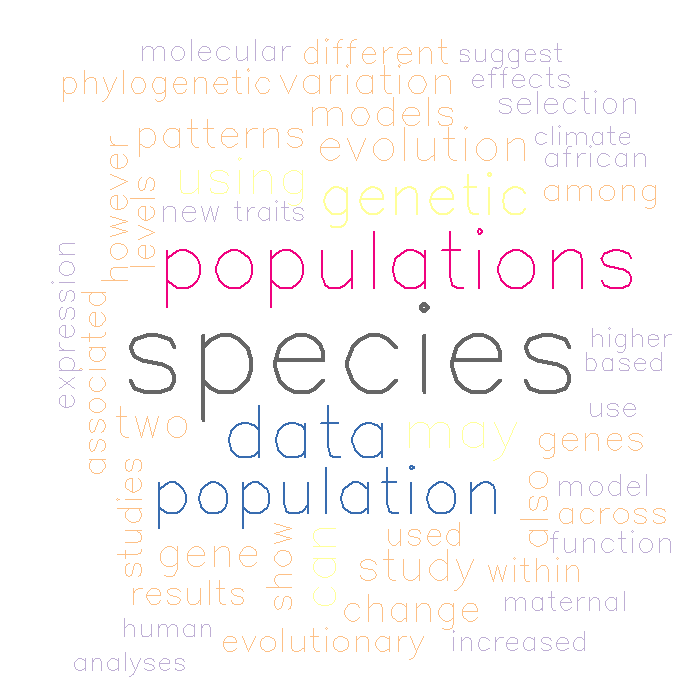
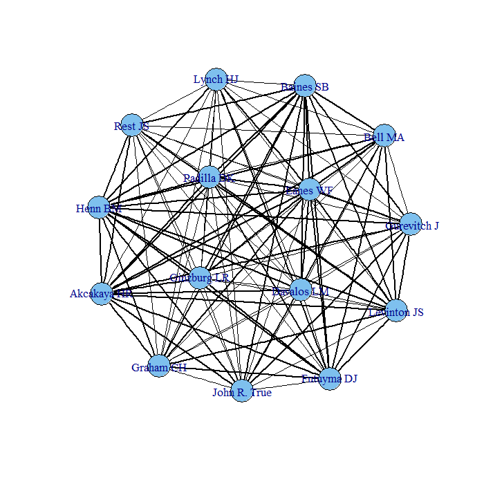
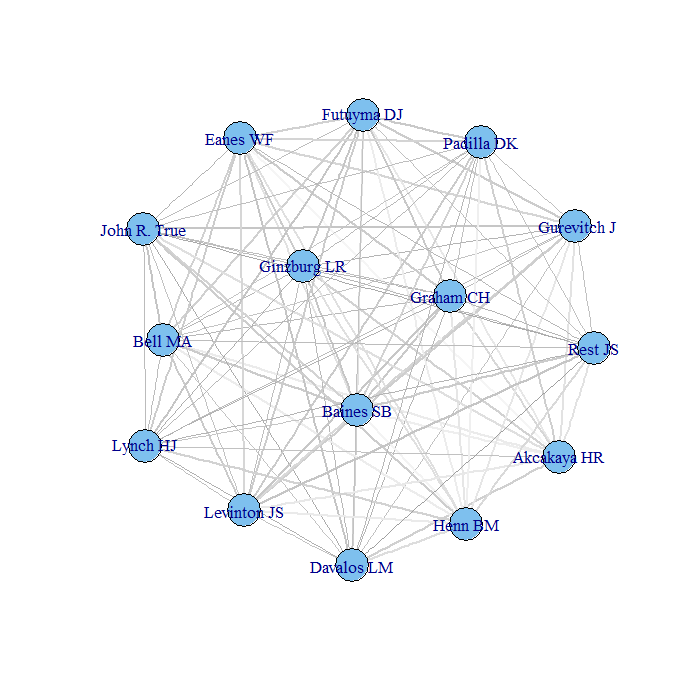
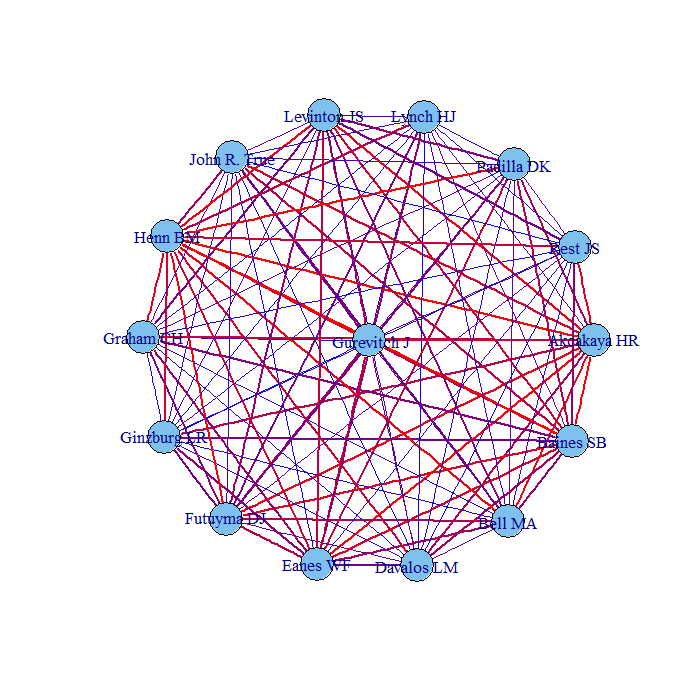

Visualizing interaction networks: An example using faculty abstracts
========================================================

I've been playing around with how best to visualize single level networks with pairwise interactions. 

Here i took 10 abstract for each member of the Stony Brook faculty and performed the following analysis:

1. Decomposed each abstract into a word cloud
2. Created a count of each word for each faculty member
3. Compared word usage among faculty members
4. Created a distance matrix among each pair of faculty
5. Created an interaction matrix


```r

opts_chunk$set(warning = FALSE, message = FALSE, dpi = 100)
# Script to take in vector of names to create word clouds and network of
# abstract word interactions ie to show how the department is connected

# load libraries

library("XML")
library("stringr")
library("RCurl")
library("wordcloud")
library("tm")
require(reshape2)
require(sna)
require(bipartite)
require(igraph)

# source functions
getAbstracts <- function(author, university, dFrom, dTill, nRecs) {
    # For more details about Pubmed queries see:
    # http://www.ncbi.nlm.nih.gov/books/NBK25500/
    
    # Text search - basic URL
    eSearch <- "http://eutils.ncbi.nlm.nih.gov/entrez/eutils/esearch.fcgi?db=pubmed&term="
    # Data record download - basic URL
    eDDownload <- "http://eutils.ncbi.nlm.nih.gov/entrez/eutils/efetch.fcgi?db=pubmed&id="
    
    # In case of multiple words (e.g., first and the last name), add '+' sign in
    # between them
    aL <- str_replace_all(author, " ", "+")
    # Add the search keyword - author
    aQ <- paste(aL, "[author]", sep = "")
    
    # Add two search queries together
    hlpQ1 <- aQ
    
    if (exists("university")) {
        aU <- str_replace_all(university, " ", "+")
        # Add the search keyword - affiliation
        aUU <- paste(aU, "[ad]", sep = "")
    }
    
    
    if (exists("university")) {
        hlpQ2 <- paste(hlpQ1, aUU, sep = "&")
    }
    
    # Add the max number of retrieved articles at the end of the query
    rmQ <- paste("&retmax=", nRecs, sep = "")
    hlpQ3 <- paste(hlpQ2, rmQ, sep = "")
    
    
    print(paste("Search term", hlpQ3))
    
    # Finalize the query and serch Pubmed
    searchUrl <- paste(eSearch, hlpQ3, sep = "")
    # Wait - to ensure that all requests will be processed
    Sys.sleep(3)
    hlpURL <- getURL(searchUrl)
    # The result is in form of XML document - you can paste the searchUrl in the
    # browser to see/download it
    doc <- xmlTreeParse(hlpURL, asText = TRUE)
    IdlistHlp = xmlValue(doc[["doc"]][["eSearchResult"]][["IdList"]])
    
    # I am sure there is more elegant way (i.e., a function) to proccess this,
    # but I was lazy to search for it
    if (length(IdlistHlp) > 0) {
        Idlist <- c()
        
        # Each ID is 8 digits long
        for (k in 1:(str_length(IdlistHlp)/8)) Idlist <- c(Idlist, str_sub(IdlistHlp, 
            start = 8 * (k - 1) + 1, end = k * 8))
        
        # Once we retrieved articles' IDs for the author/dates, we can process them
        # and get abstracts
        Sys.sleep(2)
        hlp1 <- paste(eDDownload, paste(Idlist, collapse = ",", sep = ""), sep = "")
        hlp2 <- paste(hlp1, "&rettype=abstract", sep = "")
        testDoc <- xmlTreeParse(hlp2, useInternalNodes = TRUE)
        topFetch <- xmlRoot(testDoc)
        abst <- xpathSApply(topFetch, "//Abstract", xmlValue)
    }
    
    # In case that nothing was found
    if (length(IdlistHlp) == 0) 
        abst = c("Zero", "Articles", "Found")
    
    abst
}

plotWC <- function(abstracts, nc, cs) {
    # Once we have abstracts, we can create a document corpus
    abstTxt <- Corpus(VectorSource(abstracts))
    
    text2.corpus = tm_map(abstTxt, removePunctuation)
    text2.corpus = tm_map(text2.corpus, tolower)
    text2.corpus = tm_map(text2.corpus, removeWords, stopwords("english"))
    
    # Transform it into a matrix and sort based on the total word occurence
    tdm <- TermDocumentMatrix(text2.corpus)
    m <- as.matrix(tdm)
    v <- sort(rowSums(m), decreasing = TRUE)
    d <- data.frame(word = names(v), freq = v)
    
    # Select the color scheme
    pal2 <- brewer.pal(nc, cs)
    
    # And plot the cloud
    wordcloud(d$word, d$freq, scale = c(8, 0.2), min.freq = 2, max.words = 50, 
        random.order = FALSE, rot.per = 0.15, color = pal2, vfont = c("sans serif", 
            "plain"))
}
```


Individual faculty: Catherine Graham
==================================


```r

# Get inputs, download abstracts, and create a corresponding wordcloud

# Run test
abs <- getAbstracts(author = "Graham Catherine H", university = "Stony Brook", 
    dFrom = 1970, dTill = 2014, nRecs = 20)
```

```
## [1] "Search term Graham+Catherine+H[author]&Stony+Brook[ad]&retmax=20"
```

```r

# plot the abstracts, the 2nd and third argument are the color brewer
# ?brewer.pal, number of colors and palette
plotWC(abs, 8, "Accent")
```

 


All faculty
=============


```r

# Step two make a network of the participants

profs <- c("Lynch HJ", "Graham CH", "Ginzburg LR", "Akcakaya HR", "Padilla DK", 
    "John R. True", "Eanes WF", "Bell MA", "Levinton JS", "Henn BM", "Davalos LM", 
    "Rest JS", " Gurevitch J", "Baines SB", "Futuyma DJ")
abs_all <- lapply(profs, function(x) {
    abs <- getAbstracts(x, "Stony Brook", 1980, 2014, 20)
})
```

```
## [1] "Search term Lynch+HJ[author]&Stony+Brook[ad]&retmax=20"
## [1] "Search term Graham+CH[author]&Stony+Brook[ad]&retmax=20"
## [1] "Search term Ginzburg+LR[author]&Stony+Brook[ad]&retmax=20"
## [1] "Search term Akcakaya+HR[author]&Stony+Brook[ad]&retmax=20"
## [1] "Search term Padilla+DK[author]&Stony+Brook[ad]&retmax=20"
## [1] "Search term John+R.+True[author]&Stony+Brook[ad]&retmax=20"
## [1] "Search term Eanes+WF[author]&Stony+Brook[ad]&retmax=20"
## [1] "Search term Bell+MA[author]&Stony+Brook[ad]&retmax=20"
## [1] "Search term Levinton+JS[author]&Stony+Brook[ad]&retmax=20"
## [1] "Search term Henn+BM[author]&Stony+Brook[ad]&retmax=20"
## [1] "Search term Davalos+LM[author]&Stony+Brook[ad]&retmax=20"
## [1] "Search term Rest+JS[author]&Stony+Brook[ad]&retmax=20"
## [1] "Search term +Gurevitch+J[author]&Stony+Brook[ad]&retmax=20"
## [1] "Search term Baines+SB[author]&Stony+Brook[ad]&retmax=20"
## [1] "Search term Futuyma+DJ[author]&Stony+Brook[ad]&retmax=20"
```

```r
names(abs_all) <- profs

print("Number of abstracts:")
```

```
## [1] "Number of abstracts:"
```

```r
abs_prof <- data.frame(profs, Abstracts = sapply(abs_all, length))

# plot all as one word cloud
plotWC(abs_all, 8, "Accent")
```

 


Decompose words into frequency counts
==========


```r

# seperate into individual matrices

me <- lapply(abs_all, function(x) {
    abstTxt <- Corpus(VectorSource(x))
    
    text2.corpus = tm_map(abstTxt, removePunctuation)
    text2.corpus = tm_map(text2.corpus, tolower)
    text2.corpus = tm_map(text2.corpus, removeWords, stopwords("english"))
    
    # Transform it into a matrix and sort based on the total word occurence
    tdm <- TermDocumentMatrix(text2.corpus)
    m <- as.matrix(tdm)
    v <- sort(rowSums(m), decreasing = TRUE)
    d <- data.frame(word = names(v), freq = v)
})

# account for richness of abstracts

for (x in 1:length(me)) {
    me[[x]]$freq <- me[[x]]$freq/abs_prof$Abstracts[[x]]
}

names(me) <- profs
mem <- melt(me)

mem$word <- as.character(mem$word)

# what are the strongest interacting words
word_matrix <- acast(mem, L1 ~ word, fill = 0)
```


Create distance matrix
========


```r
# as distance matrix
dist_matrix <- dist(word_matrix)

# To do only keep shared words?

g <- graph.adjacency(as.matrix(dist_matrix), diag = FALSE, mode = "lower", weighted = TRUE)

# names of the vertices you just imported:
V(g)$name
```

```
##  [1] " Gurevitch J" "Akcakaya HR"  "Baines SB"    "Bell MA"     
##  [5] "Davalos LM"   "Eanes WF"     "Futuyma DJ"   "Ginzburg LR" 
##  [9] "Graham CH"    "Henn BM"      "John R. True" "Levinton JS" 
## [13] "Lynch HJ"     "Padilla DK"   "Rest JS"
```

```r
E(g)$size
```

```
## NULL
```

```r

plot.igraph(g, layout = layout.fruchterman.reingold, edge.color = "black", edge.width = E(g)$weight/4)
```

 

```r

# color by weight
cols <- gray(E(g)$weight/max(E(g)$weight))

plot.igraph(g, layout = layout.fruchterman.reingold, edge.color = cols, edge.width = E(g)$weight/4)
```

 

```r

# that was grey, try color

colramp <- colorRampPalette(c("blue", "red"))(length(E(g)$weight))

# original order
orig <- E(g)$weight/max(E(g)$weight)

orig.order <- data.frame(orig, 1:length(orig))

weight.order <- orig.order[order(E(g)$weight/max(E(g)$weight)), ]

# merge with col
colramp.w <- data.frame(weight.order, colramp)

# get original order
colsRB <- colramp.w[order(colramp.w$X1.length.orig.), ]

plot.igraph(g, layout = layout.fruchterman.reingold, edge.color = as.character(colsRB$colramp), 
    edge.width = (E(g)$weight/4))
```

 

```r

mem$word <- as.character(mem$word)


# make another prettier graph

## Test
mem[order(mem$value, decreasing = TRUE), ][1:20, ]
```

```
##               word variable value           L1
## 2434       species     freq 4.158  Akcakaya HR
## 7604   populations     freq 4.105      Henn BM
## 7605       african     freq 2.263      Henn BM
## 2435        models     freq 2.105  Akcakaya HR
## 2436        change     freq 2.053  Akcakaya HR
## 3528       species     freq 2.000   Padilla DK
## 2437    population     freq 1.947  Akcakaya HR
## 7606    population     freq 1.947      Henn BM
## 2438       climate     freq 1.895  Akcakaya HR
## 12148        cells     freq 1.889    Baines SB
## 11080       artery     freq 1.882  Gurevitch J
## 11081     patients     freq 1.765  Gurevitch J
## 7607       genetic     freq 1.737      Henn BM
## 6995    resistance     freq 1.667  Levinton JS
## 7608          data     freq 1.632      Henn BM
## 7609         human     freq 1.632      Henn BM
## 12674        plant     freq 1.625   Futuyma DJ
## 3529    plasticity     freq 1.600   Padilla DK
## 1     survivorship     freq 1.583     Lynch HJ
## 5131      activity     freq 1.550     Eanes WF
```


Trying different layouts
===


```r
plot.igraph(g, layout = layout.lgl, edge.color = as.character(colsRB$colramp), 
    edge.width = (E(g)$weight/4))
```

 

```r

layout <- layout.reingold.tilford(g, circular = T)

plot.igraph(g, layout = layout, edge.color = as.character(colsRB$colramp), edge.width = (E(g)$weight/4))
```

 

```r


plot.igraph(g, layout = layout.auto, edge.color = as.character(colsRB$colramp), 
    edge.width = (E(g)$weight/4))
```

 
