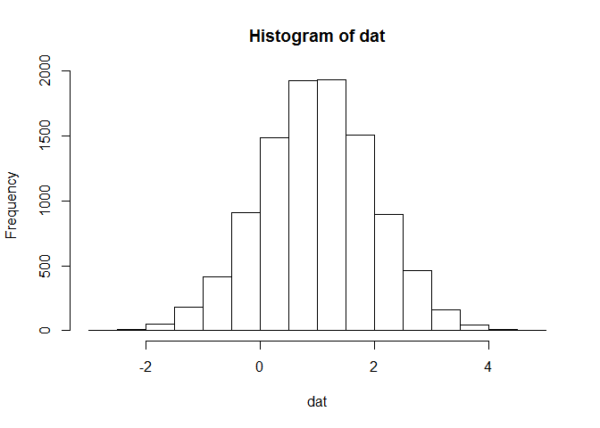
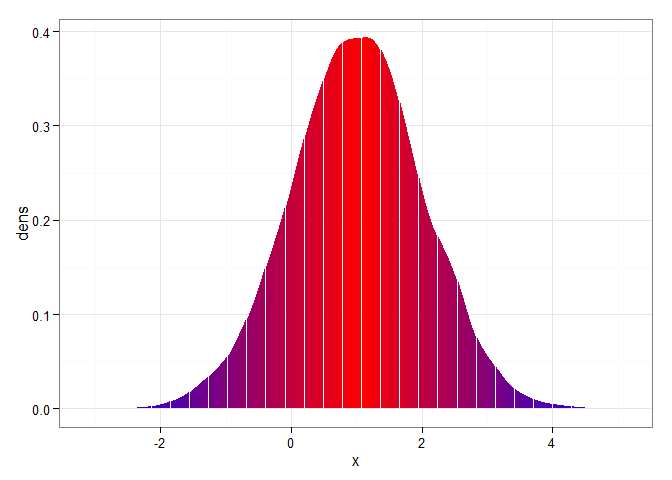
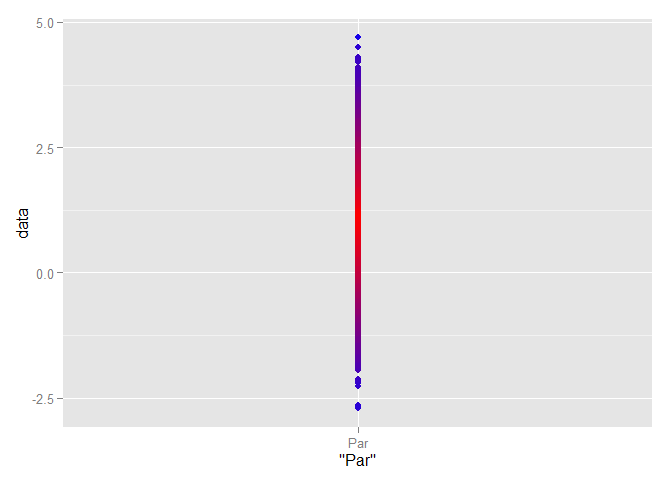
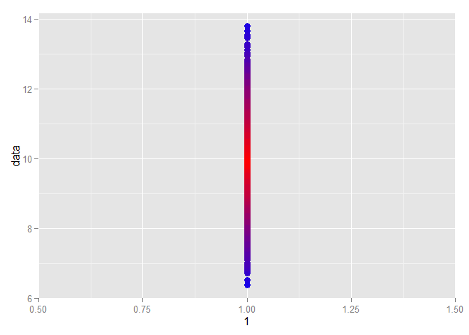
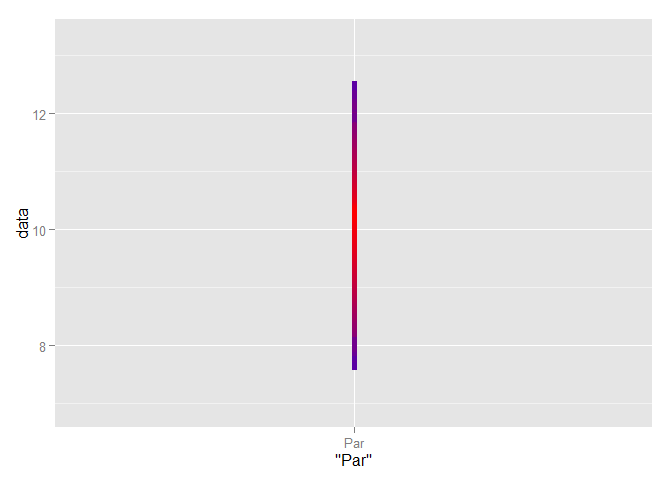
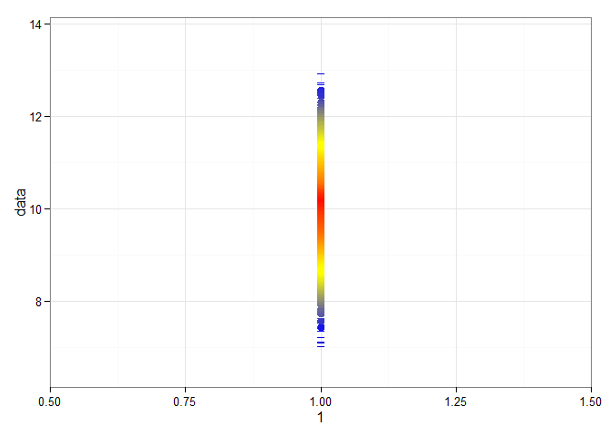

# PostPlot
Ben Weinstein  
November 5, 2015  

#Question from Heather.

Quick question (cc: my my new post doc and Bayesian guru Chris Castaldo). Chris and I are trying to illustrate a large number of posteriors, and I had the thought that we could project the posterior distribution onto a line, using color to represent density. So, using a rainbow color scheme, it would be red in the center (where density was highest) and then trending to blue at the margins. Do you have any code to do something like this, where color is used to represent density?

Let's build this slowly.

Let's say we had a distribution.

 

We could calculate a kernel density smoother

```r
a<-density(dat)
d<-data.frame(x=a$x,dens=a$y)
```

Sort by density


```r
rd<-d[order(d$dens),]
```

Create a color ramp from blue to red with 1000 breaks

```r
rd$cols<-colorRampPalette(c("blue","red"))(nrow(rd))
```

Did that work? Plot density distribution by color?


```r
ggplot(rd,aes(x=x,y=dens,col=cols)) + geom_segment(yend=0,aes(xend=x)) + scale_color_identity() + theme_bw()
```

 

Okay that's great, but that was for the kernel smoother, not the observer values.

For the observed data, sample the cumulative distribution and round to the nearest position.


```r
quant<-round(ecdf(rd$x)(dat)*nrow(rd))
```

Re-sort by x value


```r
ord<-rd[order(rd$x),]
cols<-ord$cols[quant]
toplot<-data.frame(data=dat,col=cols)
```

Start with points

```r
ggplot(toplot,aes(x="Par",y=data,col=col)) + geom_point(size=2) + scale_color_identity()
```

 

Wrap that into a function


```r
plotit<-function(dat,colors){
a<-density(dat)
d<-data.frame(x=a$x,dens=a$y)
rd<-d[order(d$dens),]
rd$cols<-colorRampPalette(colors)(nrow(rd))
quant<-round(ecdf(rd$x)(dat)*nrow(rd))
ord<-rd[order(rd$x),]
cols<-ord$cols[quant]
return(cols)  
}
```

So the function takes in a vector of point estimates and a c("colors") and should return colors for any density estimate


```r
d<-rnorm(10000,10)
toplot<-data.frame(data=d,col=plotit(d,c("blue","red")))
ggplot(toplot,aes(x=1,y=data,col=col)) + geom_point(size=3) + scale_color_identity()
```

 

Okay that looks great. but we want line segments, not points.


```r
d<-rnorm(1000,10)
toplot<-data.frame(data=d,col=plotit(d,c("blue","red")))
ggplot(toplot,aes(x="Par",y=data,col=col)) + geom_line(size=2) + scale_color_identity()
```

 

I think it looks best with three or four colors, but its not entirely clear the accuracy of this approach and the importance of the bins

```r
d<-rnorm(10000,10)
toplot<-data.frame(data=d,col=plotit(d,c("black","blue","yellow","red")))
ggplot(toplot,aes(x=1,y=data,col=col)) + geom_line(size=3) + scale_color_identity() + theme_bw()
```

 

Using with alpha?

```r
plotit<-function(dat,colors){
a<-density(dat)
d<-data.frame(x=a$x,dens=a$y)
rd<-d[order(d$dens),]
rd$cols<-colorRampPalette(colors,alpha=T)(nrow(rd))
quant<-round(ecdf(rd$x)(dat)*nrow(rd))
ord<-rd[order(rd$x),]
cols<-ord$cols[quant]
return(cols)  
}
```
Looks like you need to specify group if you turn alpha on.

```r
d<-rnorm(10000,10)
toplot<-data.frame(data=d,col=plotit(d,c("blue","yellow","red")))
ggplot(toplot,aes(x="Par",y=data,col=col)) + geom_line(size=4,aes(group=1)) + scale_color_identity() + theme_bw()
```

 

Back to two colors, with alpha.

```r
d<-rnorm(100000,10,100)
toplot<-data.frame(data=d,col=plotit(d,c("blue","red")))
ggplot(toplot,aes(x="Par",y=data,col=col)) + geom_line(size=4,aes(group=1)) + scale_color_identity() + theme_bw()
```

 


Other distributions, not so hot, any ideas why?
Points look fine.

```r
d<-rpois(1000,10)
toplot<-data.frame(data=d,col=plotit(d,c("blue","red")))
ggplot(toplot,aes(x="Par",y=data,col=col)) + geom_point(size=3) + scale_color_identity()
```

 

Line segments don't really work with discontinious distributions

```r
d<-rpois(1000,10)
toplot<-data.frame(data=d,col=plotit(d,c("blue","red")))
ggplot(toplot,aes(x="Par",y=data,col=col)) + geom_line() + scale_color_identity()
```

 
